# End-to-End Image Stitching Network via Multi-Homography Estimation

Official project page **"End-to-End Image Stitching Network via Multi-Homography Estimation"**

Accepted at ***IEEE Signal Processing Letters 2021***

https://ieeexplore.ieee.org/document/9393563


Dae-Young Song<sup>[1]</sup> , Gi-Mun Um<sup>[2]</sup>, Hee Kyung Lee<sup>[2]</sup> and Donghyeon Cho<sup>[1]</sup>

This paper is one of the outcomes of an industry-academic cooperation project with **ETRI** (Electronics and Telecommunications Research Institute).

The dataset and source code are ETRI's assets.

[1] The Department of Electronics Engineering, Chungnam National University

[2] Communication Media Research Laboratory, ETRI


## I. Abstract

In this paper, we propose an end-to-end stitching network, which takes two images with a narrow field of view (FOV) as inputs, and produces a single image with a wide FOV. Our method estimates multiple homographies to cover the depth differences in the scene and is therefore robust against parallax distortion. In particular, global warping maps are generated using estimated multiple homographies and adjusted by local displacement maps. The final result is made by warping input images multiple times using the warping maps and then merging warped images with the weight maps. Multiple homographies, local displacement maps, and weight maps are generated simultaneously by our stitching network. To train the stitching network, we construct a dataset using the CARLA simulator. Then, using this dataset, our network is trained by end-to-end supervised learning based on appearance matching loss and depth layer loss. In experiments, we show that our method is superior to existing methods both qualitatively and quantitatively. Also, we provide various empirical studies for in-depth analysis as well as the result of the expansion to 360 degree panoramas.


## II. End-to-End Stitching


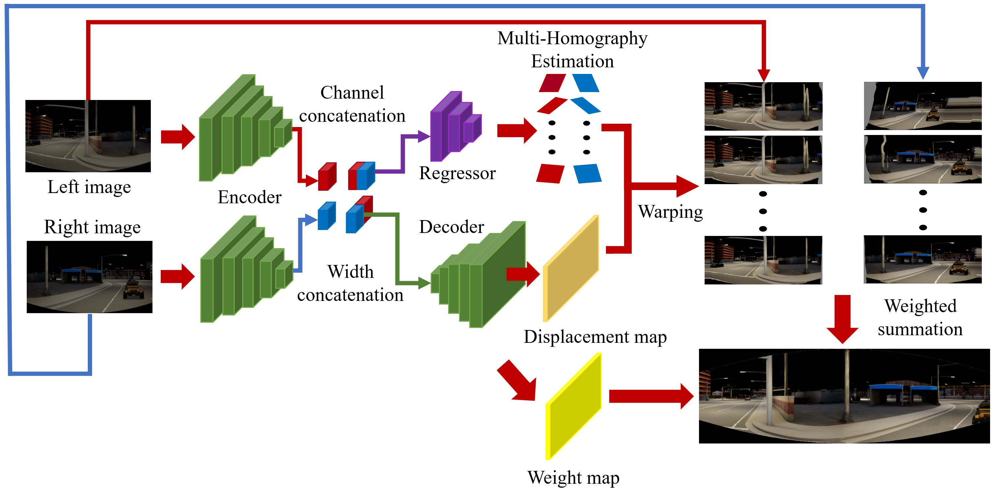


## III. Training Dataset in the Paper

all datasets are produced using ***CARLA***<sup>[3]</sup> simulator and autopilot.

- total 42,777 sets

- Input FoV : 90 degree (rotated ±30 degree from ground-truth)

- Ground-truth FoV : 120 degree

- Direction : front (17,599 sets) + right (25,178 sets)

- input image configuration

  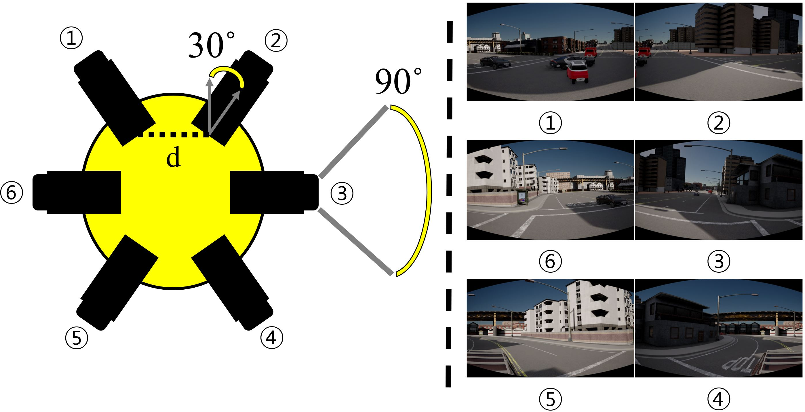

- Examples

  | left (front dir.)                         | right (front dir.)                         |
  | ----------------------------------------- | ------------------------------------------ |
  | 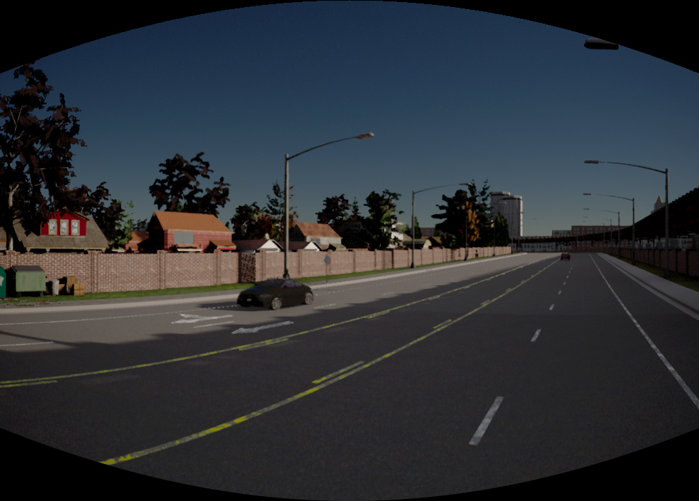 |  |
  | **ground-truth (front dir.)**             | **depth (front dir.)**                     |
  | 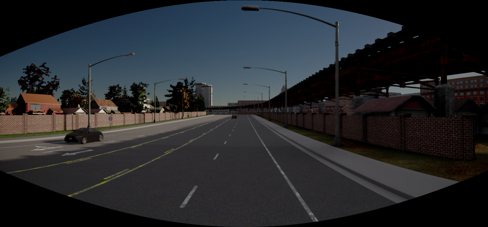   | 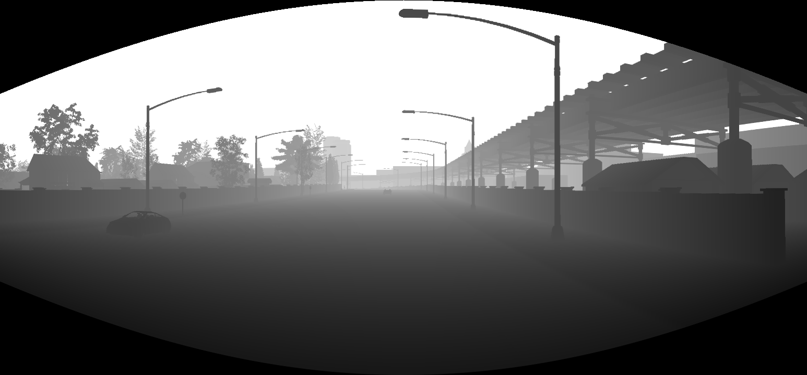 |
  | **left (right dir.)**                     | **right (right dir.)**                     |
  | 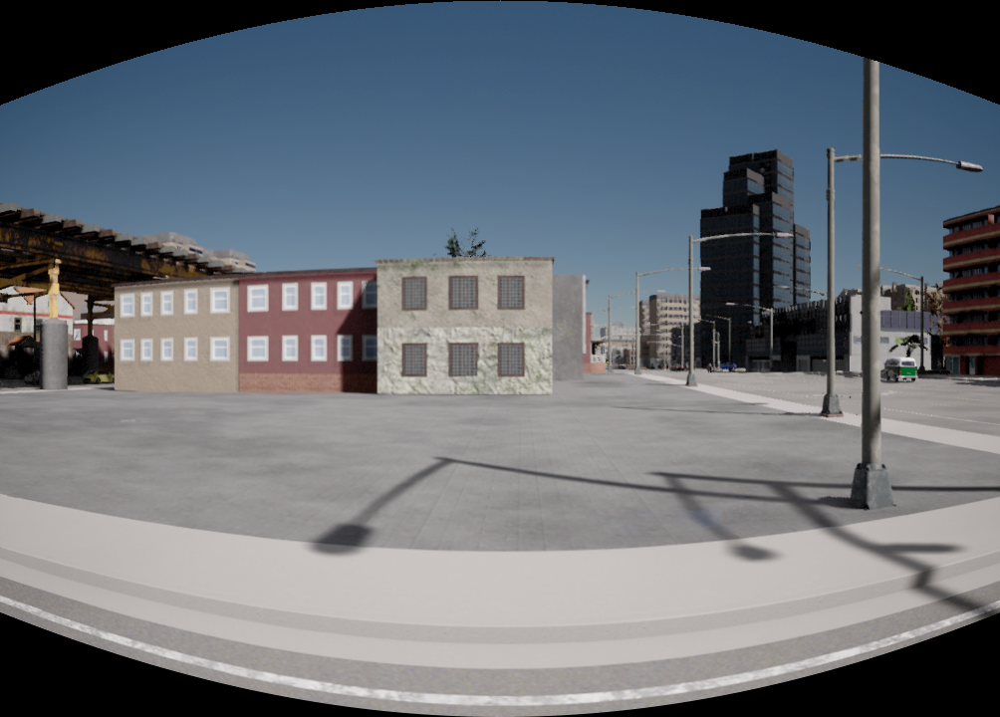 | 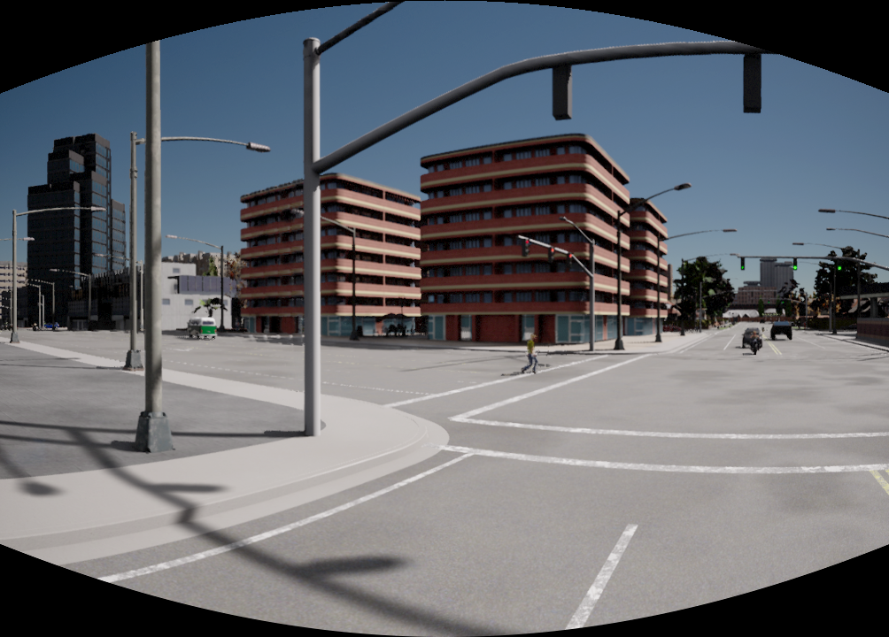 |
  | **ground-truth (right dir.)**             | **depth (right dir.)**                     |
  | 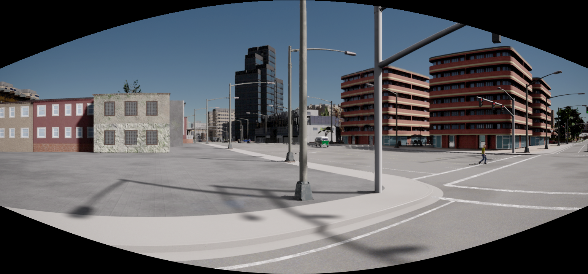   | 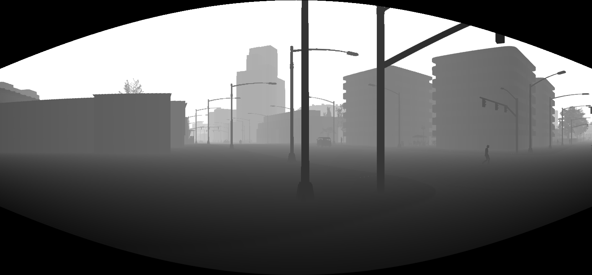 |

[3] : https://github.com/carla-simulator/carla


## IV. Network Architecture

*(asterisk) indicates that BatchNorm and ELU layer follow immediately after the marked layer.

@ indicates that layer receives skip-connection input.

***N*** indicates # of depth layers.


### 1. Encoder

| layer   | kernel | stride | channel | pad  | scale_in | scale_out |
| ------- | ------ | ------ | ------- | ---- | -------- | --------- |
| Conv1*  | 7      | 1      | 3/32    | 3    | 1        | 1         |
| Conv1b* | 7      | 2      | 32/32   | 3    | 1        | 2         |
| Conv2*  | 5      | 1      | 32/64   | 2    | 2        | 2         |
| Conv2b* | 5      | 2      | 64/64   | 2    | 2        | 4         |
| Conv3*  | 3      | 1      | 64/128  | 1    | 4        | 4         |
| Conv3b* | 3      | 2      | 128/128 | 1    | 4        | 8         |
| Conv4*  | 3      | 1      | 128/256 | 1    | 8        | 8         |
| Conv4b* | 3      | 2      | 256/256 | 1    | 8        | 16        |
| Conv5*  | 3      | 1      | 256/512 | 1    | 16       | 16        |
| Conv5b* | 3      | 2      | 512/512 | 1    | 16       | 32        |
| Conv6*  | 3      | 1      | 512/512 | 1    | 32       | 32        |
| Conv6b* | 3      | 2      | 512/512 | 1    | 32       | 64        |
| Conv7*  | 3      | 1      | 512/512 | 1    | 64       | 64        |
| Conv7b* | 3      | 2      | 512/512 | 1    | 64       | 128       |


### 2. Decoder

| layer    | kernel | stride | channel  | pad  | scale_in | scale_out |
| -------- | ------ | ------ | -------- | ---- | -------- | --------- |
| Upconv7* | 3      | 1      | 512/512  | 1    | 128      | 64        |
| Iconv7@* | 3      | 1      | 1024/512 | 1    | 64       | 64        |
| Upconv6* | 3      | 1      | 512/512  | 1    | 64       | 32        |
| Iconv6@* | 3      | 1      | 1024/512 | 1    | 32       | 32        |
| Upconv5* | 3      | 1      | 512/256  | 1    | 32       | 16        |
| Iconv5@* | 3      | 1      | 512/256  | 1    | 16       | 16        |
| Upconv4* | 3      | 1      | 256/128  | 1    | 16       | 8         |
| Iconv4@* | 3      | 1      | 256/128  | 1    | 8        | 8         |
| Upconv3* | 3      | 1      | 128/64   | 1    | 8        | 4         |
| Iconv3@* | 3      | 1      | 128/64   | 1    | 4        | 4         |
| Upconv2* | 3      | 1      | 64/32    | 1    | 4        | 2         |
| Iconv2@* | 3      | 1      | 64/32    | 1    | 2        | 2         |
| Upconv1* | 3      | 1      | 32/16    | 1    | 2        | 1         |
| Iconv1*  | 3      | 1      | 16/16    | 1    | 1        | 1         |


### 3. Regressor

| layer    | kernel | stride | channel                    | pad  | scale_in | scale_out |
| -------- | ------ | ------ | -------------------------- | ---- | -------- | --------- |
| Conv45*  | 3      | 2      | 1024/512                   | 1    | 128      | 128       |
| Conv5a*  | 3      | 1      | 512/512                    | 1    | 128      | 128       |
| Conv5b*  | 3      | 1      | 512/512                    | 1    | 128      | 128       |
| Conv56*  | 1      | 2      | 512/512                    | 1    | 128      | 128       |
| Conv6a*  | 1      | 1      | 512/512                    | 1    | 128      | 128       |
| Conv6b*  | 1      | 1      | 512/512                    | 1    | 128      | 128       |
| avg_pool |        |        |                            |      |          |           |
| FC       |        |        | 512/[2***N*** x 2 x 3]     |      |          |           |
| reshape  |        |        | [Batch x 2***N*** x 2 x 3] |      |          |           |


### 4. Displacement Map Generation

```Conv (16 / [2 x 2])
 - Conv (16 / [2 x 2N], kernel=3, stride=1, pad=1)
 - Tanh
```


### 5. Weight Map Generation

```
 - Conv (16 / [2 x 2N], kernel=3, stride=1, pad=1)
 - Softmax
```


## V. Performance

#### Ablation studies according to the number of homographies(K)

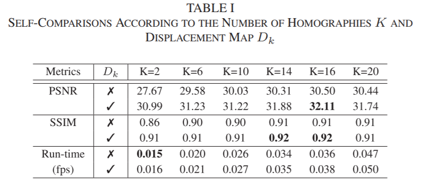

---

#### Method Evaluation

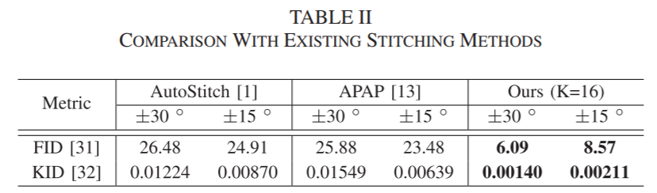


## VI. Citation

```
@ARTICLE{9393563,
  author={Song, Dae-Young and Um, Gi-Mun and Lee, Hee Kyung and Cho, Donghyeon},
  journal={IEEE Signal Processing Letters}, 
  title={End-to-End Image Stitching Network via Multi-Homography Estimation}, 
  year={2021},
  volume={28},
  number={},
  pages={763-767},
  doi={10.1109/LSP.2021.3070525}}
```

